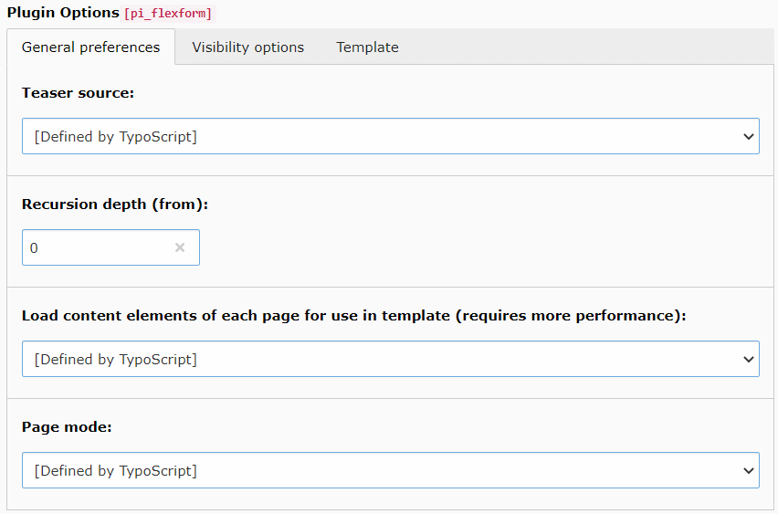
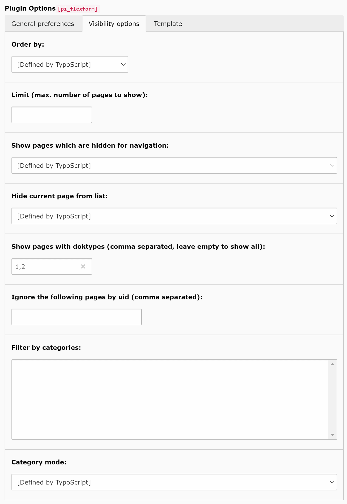
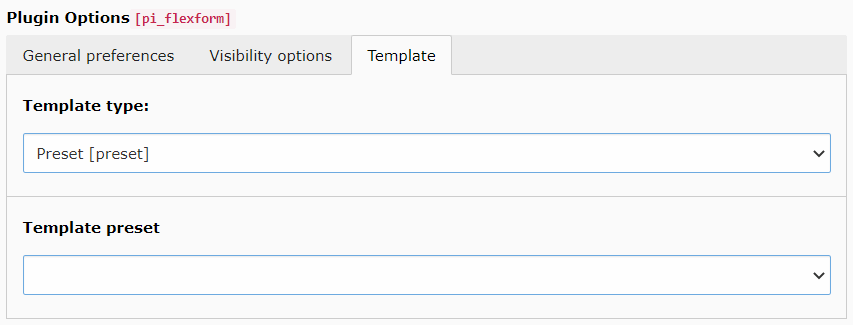

.. include:: ../Includes.txt

.. _configuration:

Configuration
=============

pw_teaser provides plugin settings, which can get preset by TypoScript. Settings set in plugin directly (FlexForm) will
overwrite the TypoScript defaults.

.. _configuration_reference:

Reference
---------

- :ref:`configuration-general`
- :ref:`configuration-visibility`
- :ref:`configuration-template`

.. _configuration-general:

General preferences
~~~~~~~~~~~~~~~~~~~

===================================== ============
Property                               Type
===================================== ============
source_                                ``string``
customPages_                           ``string``
recursionDepthFrom_                    ``integer``
recursionDepth_                        ``integer``
orderByPlugin_                         ``bool``
loadContents_                          ``bool``
pageMode_                              ``string``
enablePagination_                      ``bool``
itemsPerPage_                          ``int``
===================================== ============

.. _source:

source
""""""
.. container:: table-row

   Property
      source
   Data type
      string
   Description
      Defines which pages should be listed. Allowed values: ``thisChildren``, ``thisChildrenRecursively``, ``custom``,
      ``customChildren`` or ``customChildrenRecursively``.

.. _customPages:

customPages
"""""""""""
.. container:: table-row

   Property
      customPages
   Data type
      string
   Description
      Comma separated list of page uids, which should get listed. In plugin this field is just visible if source got
      one of the values ``custom``, ``customChildren`` or ``customChildrenRecursively``.

.. _recursionDepthFrom:

recursionDepthFrom
""""""""""""""""""
.. container:: table-row

   Property
      recursionDepthFrom
   Data type
      integer
   Default
      0
   Description
      Start of recursion depth. Default is zero (0).
      Just takes effect if source is ``thisChildrenRecursively`` or ``customChildrenRecursively``.

.. _recursionDepth:

recursionDepth
""""""""""""""
.. container:: table-row

   Property
      recursionDepth
   Data type
      integer
   Default
      0
   Description
      Depth of recursion. Just takes effect if source is ``thisChildrenRecursively`` or ``customChildrenRecursively``.

.. _orderByPlugin:

orderByPlugin
"""""""""""""
.. container:: table-row

   Property
      orderByPlugin
   Data type
      boolean
   Default
      0
   Description
      Just visible if source got the value ``custom``.
      If enabled the pages will be ordered like defined in field customPages.

.. _loadContents:

loadContents
""""""""""""
.. container:: table-row

   Property
      loadContents
   Data type
      boolean
   Default
      0
   Description
      If checked the contents (tt_content) of current page will be loaded too.
      This may need more performance, and should only be enabled if used.

.. _pageMode:

pageMode
""""""""
.. container:: table-row

   Property
      pageMode
   Data type
      string
   Default
      flat
   Description
      Defines how found pages should be passed to fluid template. Possible values are: ``flat`` and ``nested``.
      Default is ``flat``. If ``nested`` is chosen, subpages get filled in the attribute "childPages" recursively
      instead of passing a flat array.

      In this case the options ``recursionDepthFrom``, ``orderBy`` and ``limit`` will be ignored.
      The option ``nested`` is not available for source custom.

.. _enablePagination:

enablePagination
""""""""""""""""
.. container:: table-row

   Property
      enablePagination
   Data type
      boolean
   Default
      1
   Description
      Provides pagination for Fluid template, when enabled.

.. _itemsPerPage:

itemsPerPage
""""""""""""
.. container:: table-row

   Property
      itemsPerPage
   Data type
      int
   Default
      10
   Description
      Amount of items (pages) to show on a single page. Only used, when ``enabledPagination`` is true.

.. _configuration-visibility:

Visibility options
~~~~~~~~~~~~~~~~~~

===================================== ============
Property                               Type
===================================== ============
orderBy_                               ``string``
orderByCustomField_                    ``string``
orderDirection_                        ``string``
limit_                                 ``integer``
showNavHiddenItems_                    ``bool``
hideCurrentPage_                       ``bool``
showDoktypes_                          ``string``
ignoreUids_                            ``string``
categoriesList_                        ``string``
categoryMode_                          ``integer``
===================================== ============

.. _orderBy:

orderBy
"""""""
.. container:: table-row

   Property
      orderBy
   Data type
      string
   Description
      Results may get ordered by: ``title``, ``sorting``, ``crdate``, ``tstamp``, ``starttime``, ``endtime``,
      ``newUntil``, ``random`` or ``customField``.

.. _orderByCustomField:

orderByCustomField
""""""""""""""""""
.. container:: table-row

   Property
      orderByCustomField
   Data type
      string
   Description
      If orderBy got value ``customField``, this field defines the name of the custom field to order by.
      This is useful if you have extended the ``pages`` table with new columns.

.. _orderDirection:

orderDirection
""""""""""""""
.. container:: table-row

   Property
      orderDirection
   Data type
      string
   Default
      asc
   Description
      Controls the direction of ordering. May be: ``asc`` or ``desc``. Has no effect when orderBy is ``random``.

.. _limit:

limit
"""""
.. container:: table-row

   Property
      limit
   Data type
      integer
   Default
      0
   Description
      Amount of pages which should be displayed. First the ordering takes effect, then it will be limited.
      When zero (0), limitation is disabled.

.. _showNavHiddenItems:

showNavHiddenItems
""""""""""""""""""
.. container:: table-row

   Property
      showNavHiddenItems
   Data type
      boolean
   Default
      0
   Description
      If enabled pages which are hidden for navigation (``nav_hide``), will be displayed anyway.

.. _hideCurrentPage:

hideCurrentPage
"""""""""""""""
.. container:: table-row

   Property
      hideCurrentPage
   Data type
      boolean
   Default
      1
   Description
      If enabled the current page will be removed from result.
      This has no effect, if the current page is no part of results anyway.

.. _showDoktypes:

showDoktypes
""""""""""""
.. container:: table-row

   Property
      showDoktypes
   Data type
      string
   Default
      1,2
   Description
      Comma separated list of ``doktype`` to display.

.. _ignoreUids:

ignoreUids
""""""""""
.. container:: table-row

   Property
      ignoreUids
   Data type
      string
   Description
      Comma separated list of page uids which should be ignored, always.

.. _categoriesList:

categoriesList
""""""""""""""
.. container:: table-row

   Property
      categoriesList
   Data type
      string
   Description
      Comma separated list of ``sys_category`` uids, which are selected.

.. _categoryMode:

categoryMode
""""""""""""
.. container:: table-row

   Property
      categoryMode
   Data type
      integer
   Description
      Mode to influence showed pages by selected categories (categoriesList). Available modes are:

      * ``1`` - Show pages with selected categories (OR)
      * ``2`` - Show pages with selected categories (AND)
      * ``3`` - Do NOT show pages witch selected categories (OR)
      * ``4`` - Do NOT show pages witch selected categories (AND)

.. _configuration-template:

Template view
~~~~~~~~~~~~~

See :ref:`templates` for further details.

===================================== ============
Property                               Type
===================================== ============
templateType_                          ``string``
templatePreset_                        ``string``
templateRootFile_                      ``string``
templateRootPath_                      ``string``
partialRootPath_                       ``string``
layoutRootPath_                        ``string``
===================================== ============

.. _templateType:

templateType
""""""""""""
.. container:: table-row

   Property
      templateType
   Data type
      string
   Default
      preset
   Description
      Defines the type of templating. The following types are supported:

      * ``preset`` (default)
      * ``file``
      * ``directory``

.. _templatePreset:

templatePreset
""""""""""""""
.. container:: table-row

   Property
      templatePreset
   Data type
      string
   Description
      Only available when templateType is set to ``preset``.
      Name of preset to use. The given preset name must be configured in TypoScript setup.

.. _templateRootFile:

templateRootFile
""""""""""""""""
.. container:: table-row

   Property
      templateRootFile
   Data type
      string
   Description
      Only available when templateType is set to ``file``.
      Full path (relative to TYPO3 root) to Fluid template file (incl. filename).

.. _templateRootPath:

templateRootPath
""""""""""""""""
.. container:: table-row

   Property
      templateRootPath
   Data type
      string
   Description
      Only available when templateType is set to ``directory``.
      Path to Fluid template directory, which contains the folder "Teaser", which contains the "Index.html" file.
      In this template mode, the directory contents must match Controller/Actions of pw_teaser.

.. _partialRootPath:

partialRootPath
"""""""""""""""
.. container:: table-row

   Property
      partialRootPath
   Data type
      string
   Description
      Set an additional root path for partials, added after pw_teaser partial root path.
      In TypoScript you can also use ``partialRootPaths`` and define several partial paths. This setting is only used,
      when ``partialRootPaths`` (from TypoScript) is empty.

.. _layoutRootPath:

layoutRootPath
""""""""""""""
.. container:: table-row

   Property
      layoutRootPath
   Data type
      string
   Description
      See ``partialRootPath`` for details. Same rules apply for this option.

