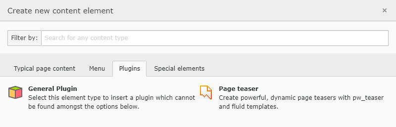
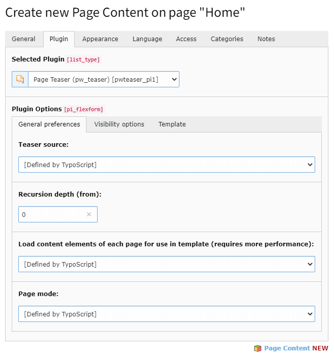
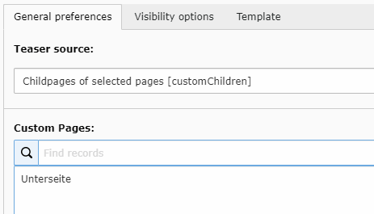
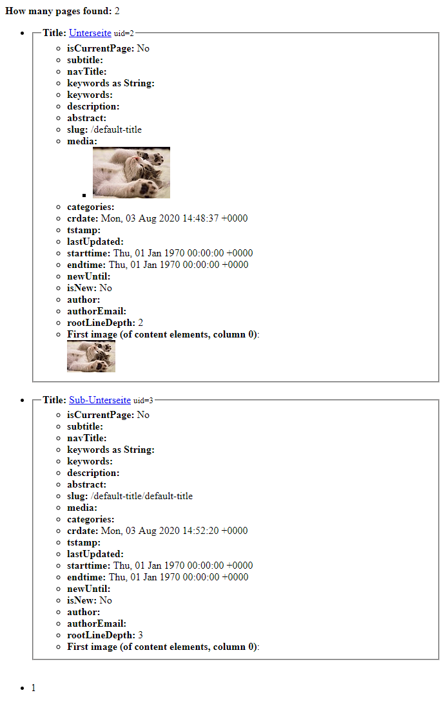

.. include:: ../Includes.txt

.. _firstSteps:

First steps
===========

Create the first teaser
-----------------------

Go to any page you want to add a teaser list of pages, and **add a new page teaser plugin**:

On tab "Plugin" you see all settings pw_teaser has:

Define data source
------------------

First, we define which pages we want to display. We can choose between those **teaser sources**:

- Childpages of current page
- Childpages of current page (recursively)
- Selected pages
- Childpages of selected pages
- Childpages of selected pages (recursively)

When you change the source to "selected pages", a new field **Custom pages** appears after reloading:

Here you select page(s) from the page tree which should be used as the source for your teaser list.

Make further options
--------------------

In visibility options, you can filter or change the ordering of pages in the result.
Under tab "Template" you can choose from some template presets.

See the teaser in frontend
--------------------------

**That's it!** Congratulations, you've configured your first page teaser!

In frontend you get a list with pages:

Checkout :ref:`templates` for info about how to provide your own templates.
