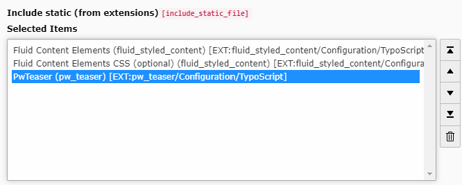

.. include:: ../Includes.txt

.. _installation:

Installation
============

Download
--------

You can use the TER (TYPO3 Extension Repository) or Composer to fetch ``t3/pw_teaser`` package.

- TER: https://extensions.typo3.org/extension/pw_teaser
- Packagist: https://packagist.org/packages/t3/pw_teaser

Don't forget to enable the extension in Extension Manager!

TypoScript Setup
----------------

When pw_teaser is successfully installed, you need to **include the provided TypoScript** to your TypoScript template:

.. important::
   When you don't include the pw_teaser TypoScript, plugin settings like "Template preset" remain empty.

That's it. Now, pw_teaser is ready to get used.
