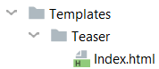

.. include:: ../Includes.txt

.. _templates:

Templates
=========

.. contents:: :local:

.. _template-types:

Template types
--------------

pw_teaser uses Fluid templates and offers three templateTypes to choose from.

Type: Preset
~~~~~~~~~~~~

The preset template mode is new (since 5.0) and offers the possibility to **define presets in TypoScript**.
Also, it provides a select box in plugin settings to **choose a preset**.

pw_comments provide three presets by default:

- ``default``
- ``headlineAndImage``
- ``headlineOnly``

**This is how you register a new preset in TypoScript:**

::

    plugin.tx_pwteaser {
        view {
            presets {
                headlineAndImage {
                    label = Headline & Images
                    templateRootFile = EXT:pw_teaser/Resources/Private/Templates/HeadlineAndImage.html
                    partialRootPaths.10 = EXT:pw_teaser/Resources/Private/Partials
                    layoutRootPaths.10 = EXT:pw_teaser/Resources/Private/Layouts
                }
            }
        }
    }

.. tip::
   The label supports ``LLL:`` references.

.. note::
   Changes in TypoScript require to clear the system caches of TYPO3.

In plugin settings, the dropdown let the editor choose, which preset to use in frontend:

.. image:: Images/preset-dropdown.png
   :alt: Preset selection in pw_teaser plugin settings

Type: File
~~~~~~~~~~

When ``view.templateType`` is set to ``file``, you also need to provide a ``view.templateRootFile`` (Fluid template file).

Type: Directory
~~~~~~~~~~~~~~~

When ``view.templateType`` is set to ``directory``, you also need to provide a ``view.templateRootPath`` (directory).
In this directory you need to provide the controller/action structure of pw_teaser:

.. _writing-templates:

Writing templates
-----------------

The only variable the Fluid template file get is ``{pages}``.
The most simple way to output the prepared (flat) list of pages is this:

::

    <ul>
        <f:for each="{pages}" as="page">
            <li>
                <f:link.page pageUid="{page.uid}" title="{page.title}">{page.title}</f:link.page>
            </li>
        </f:for>
    </ul>

The provided ``Page`` model got the following properties available:

- ``title``
- ``subtitle``
- ``abstract``
- ``navTitle``
- ``alias``
- ``description``
- ``author``
- ``authorEmail``
- ``keywords`` as array with each keyword as string
- ``keywordsAsString``
- ``media``
- ``newUntil``
- ``isNew``
- ``creationDate``
- ``tstamp``
- ``lastUpdated``
- ``starttime``
- ``endtime``
- ``doktype``
- ``sorting``
- ``l18nConfiguration``
- ``categories``
- ``isCurrentPage``
- ``rootLine`` Returns rootLine of this page as array
- ``rootLineDepth`` Returns amount of parent pages, including this page itself. The root page (not id=0) got depth 1.
- ``recursiveRootLineOrdering`` Returns string of sortings of all root pages including this page.
- ``pageRow``
- ``contents`` (only available, when ``loadContents`` set to ``1``)
- ``childPages`` (only available, when ``pageMode`` set to ``nested``)
- ``get``

You can access any property the ``pages`` table got, using the ``get`` keyword. Example:

::

    {page.get.tx_myext_whatever}

.. note::
   In the past, the ``get`` keyword wasn't necessary, because Fluid allowed to utilize ``__call()`` method of PHP,
   which is no longer the case.

getContent ViewHelper
~~~~~~~~~~~~~~~~~~~~~

The pw_teaser extension provides a view helper called ``pw:getContent``.
This view helper allows you to access special content elements from the current page in the loop.

The page has the attribute "contents". You may access it like this:

::

    {page.contents}

But it contains just an array (query result) with all content elements located under the given page.
It does not respect the column or the CType. This is where getContent comes into play.

**Full example:**

::

    {namespace pw=PwTeaserTeam\PwTeaser\ViewHelpers}
    <f:for each="{pages}" as="page">
        

            <h3>{page.title}</h3>
            <pw:getContent contents="{page.contents}" as="content" colPos="0" cType="textpic" index="0">
                <f:for each="{content.image}" as="image" iteration="iterator">
                    <f:if condition="{iterator.isFirst} == 1">
                        <f:image src="{image.uid}" treatIdAsReference="1" width="400c" height="100c" />
                    </f:if>
                </f:for>
            </pw:getContent>
        

    </f:for>

**pw:getContent arguments explained:**

- ``contents="{page.contents}"`` - Here you pass all content elements to the view helper
- ``as="content"`` - Here you define how to call the single content item inside of the view helper
- ``colPos="0"`` - Limit the content elements to given colPos (0 is default)
- ``cType="textpic"`` - Limit the content elements to given CType (eg. image, text or textpic)
- ``index="0"`` - Limit the output to n-th elements. Zero means the first element. Keep it empty for all matching elements.

When accessing images from content elements (or pages either) you can use a ``<f:for>`` loop and its option "iteration"
to limit output to one image. Therefore the example above has another <f:for>-loop inside of the getContent view helper.

.. important::
   This just works if you enable the option in Page Teaser Plugin, to load content elements.
